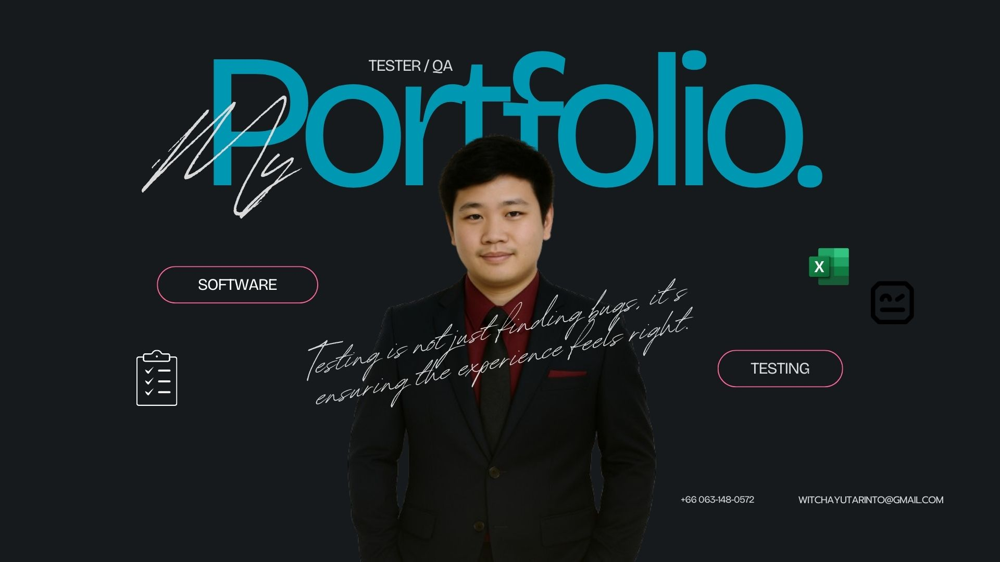

<!-- Banner / Cover -->

  

<h1 align="center">
  Hello, I’m Witchayut Arinto 
  
</h1>

  <strong>🧪 Software Tester • 🛡 Quality Advocate • 📚 Lifelong Learner</strong> 
  <em>“Ensuring software works flawlessly and delivers real value.”</em>

---

## 🚀 About Me
- 🌱 Currently learning: **Robot Framework & Selenium**  
- 🛠 Daily driver stack: **VSCode · SeleniumLibrary · Allure Report**  
- 🎯 2025 Goal: *Continuously enhancing my testing skills to achieve greater expertise, contributing value to the company and supporting long-term career growth.*  
- 📫 Reach me: **witchayutarinto@gmail.com** | 📱 063-148-0572  

---

## 🧰 Tech Stack & Tools
| Domain | Primary | Comfortable | Exploring |
|--------|---------|-------------|-----------|
| Tester |   |  |   |

---

## 📌 Featured Projects
| Project | Tech | Highlights | Links |
|---------|------|-----------|-------|
| Agri Equipment Rental Automation Testing | Robot Framework · Selenium | Automation Testing | [Repo](#) |
---

## ✍🏻 Recent Blog / Talks
- 📝 *2025* • Developing automated tests using **Robot Framework** for a university project  

---

## 📈 GitHub Stats

  
  

---

## 🤝 Let’s Connect
> **“Great products are built by great people working together.”**

- 💌 Email: [witchayutarinto@gmail.com](mailto:witchayutarinto@gmail.com)  
- 📘 Facebook: [Witchayut Arinto](https://www.facebook.com/witchayut.arinto/)  

---

<!-- Wave Footer -->

  

<!-- Typing Animation -->

  

